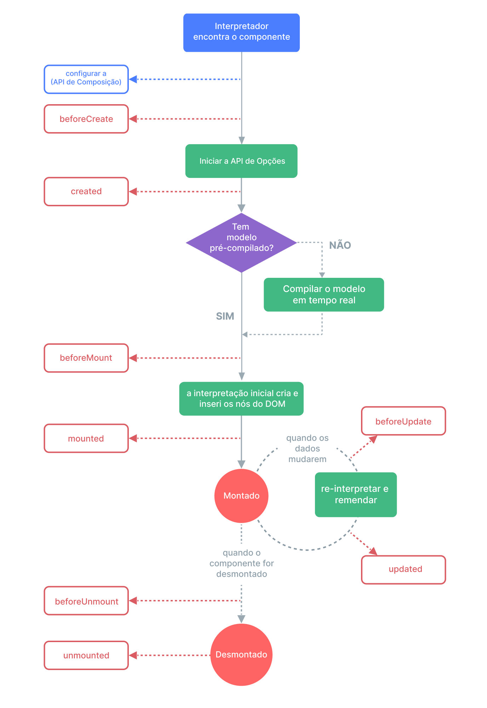

# Funções Gatilho do Ciclo de Vida {#lifecycle-hooks}

Cada instância do componente de Vue percorre uma séria de etapas de inicialização quando for criado - por exemplo, este precisa definir a observação de dados, compilar o modelo de marcação, montar a instância ao DOM, e atualizar o DOM quando os dados mudarem. Pelo caminho, este também executa funções chamadas de funções gatilhos do ciclo de vida, dando aos utilizadores a oportunidade de adicionar o seu próprio código em estágios específicos.

## Registando Gatilhos do Ciclo de Vida {#registering-lifecycle-hooks}

Por exemplo, o gatilho <span class="composition-api">`onMounted`</span><span class="options-api">`mounted`</span> pode ser utilizado para executar o código depois de terminado a interpretação inicial e criado os nós do DOM:

<div class="composition-api">

```vue
<script setup>
import { onMounted } from 'vue'

onMounted(() => {
  console.log(`the component is now mounted.`)
})
</script>
```

</div>
<div class="options-api">

```js
export default {
  mounted() {
    console.log(`the component is now mounted.`)
  }
}
```

</div>

Também existem outros gatilhos que serão chamados em diferentes estágios do ciclo de vida da instância, com os mais comummente utilizados sendo <span class="composition-api">[`onMounted`](/api/composition-api-lifecycle#onmounted), [`onUpdated`](/api/composition-api-lifecycle#onupdated), e [`onUnmounted`](/api/composition-api-lifecycle#onunmounted).</span><span class="options-api">[`mounted`](/api/options-lifecycle#mounted), [`updated`](/api/options-lifecycle#updated), e [`unmounted`](/api/options-lifecycle#unmounted).</span>.

<div class="options-api">

Todos os gatilhos do ciclo de vida são chamados com o seus contextos de `this` apontando para atual instância ativa que estiver invocando-a. Nota que isto significa que deves evitar a utilização de funções em flecha quando estiveres declarando gatilhos do ciclo de vida, visto que não serás capaz de acessar a instância do componente através de `this` se o fizeres.

</div>

<div class="composition-api">

Quando estiveres chamando `onMounted`, a Vue associa automaticamente a função de resposta registada com a atual instância do componente ativo. Isto exige que estes gatilhos sejam registados **de forma síncrona** durante a definição de componente. Por exemplo, não faça isto:

```js
setTimeout(() => {
  onMounted(() => {
    // isto não funcionará.
  })
}, 100)
```

Repare que isto não significa que a chamada deve ser colocada de maneira léxica dentro de `setup()` ou `<script setup>`. A `onMounted()` pode ser chamada em uma função externa enquanto a pilha de chamada for síncrona e surgir de dentro de `setup()`.

</div>

## Diagrama do Ciclo de Vida {#lifecycle-diagram}

Abaixo está um diagrama para o ciclo de vida da instância. Tu não precisas exatamente entender tudo agora, mas a medida que aprenderes e construires mais, será uma referência útil.



<!-- https://www.figma.com/file/Xw3UeNMOralY6NV7gSjWdS/Vue-Lifecycle -->

Consulte a <span class="composition-api">[referência de API de Gatilhos do Ciclo de Vida](/api/composition-api-lifecycle)</span><span class="options-api">[referência de API de Gatilhos do Ciclo de Vida](/api/options-lifecycle)</span> para obter detalhes sobre todos gatilhos do ciclo de vida e seus respetivos casos de uso.
