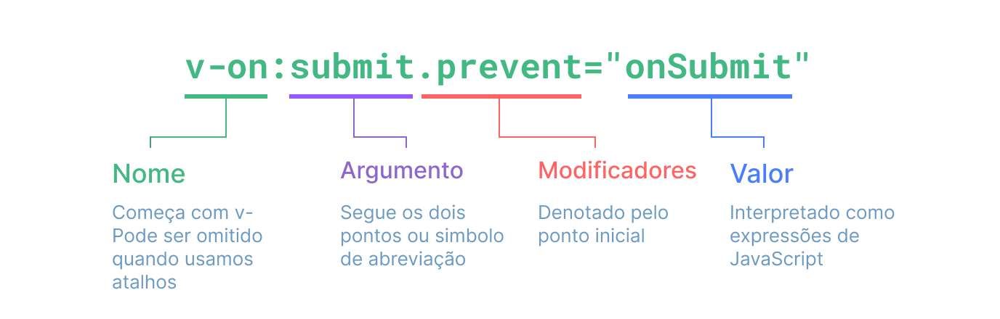

# Sintaxe do Modelo de Marcação {#template-syntax}

A Vue utiliza uma sintaxe de modelo de marcação baseada na HTML que permite-te vincular de maneira declarativa o DOM interpretado aos dados da instância do componente subjacente. Todos modelos de marcação de Vue são HTML sintaticamente validos que podem ser analisados por navegadores e analisadores de HTML compatíveis a especificação.

Nos bastidores, a Vua compila os modelos de marcação para um código de JavaScript altamente otimizado. Combinada com o sistema de reatividade, a Vue é capaz de compreender inteligentemente o número mínimo de componentes à reinterpretar e aplicar a quantidade mínima de manipulações do DOM quando o estado da aplicação mudar.

Se estiveres familiarizado com os conceitos do DOM Virtual e preferires o poder bruto da JavaScript, também podes [escrever diretamente funções de interpretação](/guide/extras/render-function) no lugar dos modelos de marcação, com suporte opcional ao JSX. No entanto, nota que eles não gozam do mesmo nível de otimizações de tempo de compilação como os modelos de marcação.

## Interpolação de Texto {#text-interpolation}

A forma mais básica de vinculação de dados é a interpolação de texto utilizando a sintaxe de chavetas duplas:

```vue-html
<span>Message: {{ msg }}</span>
```

O marcador de bigode será substituído com o valor da propriedade `msg` a partir da instância do componente correspondente. Ele também será atualizado sempre que a propriedade `msg` mudar.

## HTML Puro {#raw-html}

Os bigodes duplos interpretam os dados como texto simples, não como HTML. Para produzir a HTML verdadeira, precisarás utilizar a [diretiva `v-html`](/api/built-in-directives#v-html):

```vue-html
<p>Using text interpolation: {{ rawHtml }}</p>
<p>Using v-html directive: <span v-html="rawHtml"></span></p>
```

<script setup>
  const rawHtml = '<span style="color: red">This should be red.</span>'
</script>

<div class="demo">
  <p>Using text interpolation: {{ rawHtml }}</p>
  <p>Using v-html directive: <span v-html="rawHtml"></span></p>
</div>

Cá nos deparamos com algo novo. O atributo `v-html` que estás vendo é chamado de uma **diretiva**. As diretivas são prefixadas com `v-` para indicar que elas são atributos especiais fornecidos pela Vue, e como podes teres achado, elas aplicam comportamento reativo especial ao DOM interpretado. Aqui, estamos dizendo basicamente "mantenha este HTML interno do elemento atualizado com a propriedade `rawHtml` sobre a atual instância ativa."

Os conteúdos do `span` serão substituído com o valor da propriedade `rawHtml`, interpretado como HTMl simples - vínculos de dados são ignorados. Nota que não podes utilizar `v-html` para compor os parciais do modelo de marcação, porque a Vue não é um motor de modelo de marcação baseado em sequências de caracteres. Ao invés disto, os componentes são privilegiados como a unidade fundamental para reutilização e composição de UI.

:::warning AVISO DE SEGURANÇA
Interpretar dinamicamente HTML arbitrário no teu sítio pode ser muito perigoso porque pode facilmente conduzir à [vulnerabilidades de XSS](https://en.wikipedia.org/wiki/Cross-site_scripting). Só utilize `v-html` em conteúdo de confiança e **nunca** no conteúdo fornecido pelo utilizador.
:::

## Vinculações de Atributo {#attribute-bindings}

Os bigodes não podem ser utilizados dentro de atributos de HTML. No lugar deles, utilize a [diretiva `v-bind`](/api/built-in-directives#v-bind):

```vue-html
<div v-bind:id="dynamicId"></div>
```

A diretiva `v-bind` manda a Vue preservar o atributo `id` do elemento em sincronia com a propriedade `dynamicId` do componente. Se o valor esperado for `null` ou `undefined`, então o atributo será removido do elemento interpretado.

### Abreviação {#shorthand}

Uma vez que `v-bind` é comummente utilizada, ela tem uma sintaxe abreviada dedicada:

```vue-html
<div :id="dynamicId"></div>
```

Os atributos que começam com `:` podem parecer um pouco diferente da HTML normal, porém é na realidade um carácter válido para os nomes de atributo e todos os navegadores suportados pela Vue podem analisá-lo corretamente. Além disto, eles não aparecem na marcação interpretada final. A sintaxe abreviada é opcional, mas provavelmente o apreciará quando aprenderes mais a respeito da sua utilização mais tarde.

> Para o resto do guia, estaremos utilizando a sintaxe abreviada nos exemplos de código, visto que é o costume mais comum para os programadores de Vue.

### Atributos Booleano {#boolean-attributes}

Os [atributos booleano](https://html.spec.whatwg.org/multipage/common-microsyntaxes.html#boolean-attributes) são atributos que podem indicar valores verdadeiro ou falso pelos valores por sua presença sobre um elemento. Por exemplo, [`disabled`](https://developer.mozilla.org/en-US/docs/Web/HTML/Attributes/disabled) é um dos atributos booleano comummente utilizados.

A `v-bind` funciona um pouco de forma diferente neste caso:

```vue-html
<button :disabled="isButtonDisabled">Button</button>
```

O atributo `disabled` será incluído se `isButtonDisabled` tiver um [valor verdadeiro](https://developer.mozilla.org/en-US/docs/Glossary/Truthy). Ele também será incluído se o valor for uma sequência de caracteres vazia, mantendo a consistência com `<button disabled="">`. Para outros [valores falsos](https://developer.mozilla.org/en-US/docs/Glossary/Falsy) o atributo será omitido.

### Vincular Vários Atributos Dinamicamente {#dynamically-binding-multiple-attributes}

Se tiveres um objeto de JavaScript representando vários atributos que se parece com isto:

<div class="composition-api">

```js
const objectOfAttrs = {
  id: 'container',
  class: 'wrapper'
}
```

</div>
<div class="options-api">

```js
data() {
  return {
    objectOfAttrs: {
      id: 'container',
      class: 'wrapper'
    }
  }
}
```

</div>

Tu podes vinculá-los a um único elemento utilizando `v-bind` sem um argumento:

```vue-html
<div v-bind="objectOfAttrs"></div>
```

## Utilizando Expressões de JavaScript {#using-javascript-expressions}

Até aqui só temos estado vinculando a chaves de propriedade simples nos modelos de marcação. Mas a Vua atualmente suporta o poder completo das expressões de JavaScript dentro de todas vinculações de data:

```vue-html
{{ number + 1 }}

{{ ok ? 'YES' : 'NO' }}

{{ message.split('').reverse().join('') }}

<div :id="`list-${id}`"></div>
```

Estas expressões serão avaliadas como JavaScript no escopo de dados da atual instância do componente.

Nos modelos de marcação de Vue, as expressões de JavaScript podem ser utilizada nas seguintes posições:

- Dentro das interpolações de texto (chavetas)
- No valor de atributo de quaisquer diretivas de Vue (atributos especiais que começam com `v-`)

### Apenas Expressões {#expressions-only}

Cada vinculação só pode conter **uma única expressão**. Uma expressão é um pedaço de código que podem avaliar para um valor. Um verificação simples é se ela pode ser utilizada depois `return`.

Portanto, as seguintes **não** funcionarão:

```vue-html
<!-- isto é uma declaração, não uma expressão: -->
{{ var a = 1 }}

<!-- controlo de fluxo também não funcionará, utilize expressões ternário -->
{{ if (ok) { return message } }}
```

### Chamando Funções {#calling-functions}

É possível chamar um método de componente exposto dentro de um expressão de vinculação:

```vue-html
<span :title="toTitleDate(date)">
  {{ formatDate(date) }}
</span>
```

:::tip NOTA
As funções chamadas dentro de expressões de vinculação ser chamada toda vez que o componente atualizar, então elas **não** devem ter quaisquer efeitos colaterais, tais como mudando dados ou acionando operações assíncronas.
:::

### Acesso Global Restrito {#restricted-globals-access}

As expressões de modelo de marcação são isolados e só têm acessos a uma [lista restrita de globais](https://github.com/vuejs/core/blob/main/packages/shared/src/globalsWhitelist.ts#L3). A lista expõe os globais embutidos comummente utilizados tais como `Math` e `Date`.

Os globais que não são explicitamente incluídos na lista, por exemplo propriedades atribuídas pelo utilizador no `window`, não serão acessíveis nas expressões de modelo de marcação. Tu podes, no entanto, explicitamente definir globais adicionais para todas as expressões de Vue adicionando-os ao [`app.config.globalProperties`](/api/application#app-config-globalproperties).

## Diretivas {#directives}

As diretivas são atributos especiais com o prefixo `v-`. A Vue fornece um número de [diretivas embutidas](/api/built-in-directives), incluindo `v-html` e `v-bind` que introduzimos acima.

Os valores de atributo de diretiva são esperadas que sejam expressões de JavaScript únicas (com a exceção de `v-for`, `v-on` e `v-slot`, que serão discutidas nas suas respetivas secções adiante). Um trabalho da diretiva é aplicar atualizações de maneira reativa ao DOM quando o valor da sua expressão mudar. Pegue [`v-if`](/api/built-in-directives#v-if) como um exemplo:

```vue-html
<p v-if="seen">Now you see me</p>
```

Cá, a diretiva `v-if` removeria ou inseriria o elemento `<p>` com base na veracidade do valor da expressão `seen`.

### Argumentos {#arguments}

Algumas diretivas podem reber um "argumento", denotado por um dois-pontos depois do nome da diretiva. Por exemplo, a diretiva `v-bind` é utilizada para atualizar um atributo de HTML de maneira reativa:

```vue-html
<a v-bind:href="url"> ... </a>

<!-- abreviação -->
<a :href="url"> ... </a>
```

Aqui `href` é um argumento, que fiz a diretiva `v-bind` para vincular o atributo `href` do elemento ao valor da expressão `url`. Resumido, tudo antes do argumento (por exemplo, `v-bind:`) é condensado para um único carácter, `:`.

Um outro exemplo é a diretiva `v-on`, que ouve os eventos do DOM:

```vue-html
<a v-on:click="doSomething"> ... </a>

<!-- abreviação -->
<a @click="doSomething"> ... </a>
```

Aqui o argumento é o nome do evento a ouvir: `click`. A `v-on` tem uma abreviação correspondente, nomeadamente o carácter `@`. Nós também falaremos a respeito de manipulação de evento com mais detalhe.

### Argumentos Dinâmicos {#dynamic-arguments}

Também é possível utilizar uma expressão de JavaScript em um argumento de diretiva envolvendo-a com parêntesis retos:

```vue-html
<!--
Nota que existem algumas restrições para a expressão de argumento,
como explicado nas secções "Restrições de Valor de Argumento Dinâmico" e "Restrições de Sintaxe de Argumento Dinâmico" abaixo.
-->
<a v-bind:[attributeName]="url"> ... </a>

<!-- abreviação -->
<a :[attributeName]="url"> ... </a>
```

Aqui o `attributeName` será avaliado dinamicamente como uma expressão de JavaScript, e seu valor avaliado será utilizado como o valor final para o argumento. Por exemplo, se a tua instância de componente tiver uma propriedade de dados `data`, `attributeName`, cujo valor é `"href"`, então esta vinculação será equivalente a `v-bind:href`.

Similarmente, podes utilizar argumentos dinâmicos para vincular um manipulador a um nome de evento dinâmico:

```vue-html
<a v-on:[eventName]="doSomething"> ... </a>

<!-- abreviação -->
<a @[eventName]="doSomething">
```

Neste exemplo, quando o valor do `eventName` for `"focus"`, `v-on:[eventName]` será equivalente a `v-on:focus`.

#### Restrições de Valor do Argumento Dinâmico {#dynamic-argument-value-constraints}

Os argumentos dinâmicos são esperados ser avaliados para uma sequência de caracteres, com a exceção de `null`. O valor especial `null` pode ser utilizado remover a vinculo de maneira explicita. Qualquer outro valor que não a sequência de caracteres acionará um alerta.

#### Restrições de Sintaxe do Argumento Dinâmico {#dynamic-argument-syntax-constraints}

As expressões de argumento dinâmico têm algumas restrições de sintaxe porque certos caracteres, tais como espaços e aspas, são inválidos dentro dos nomes de atributos de HTML. Por exemplo, o seguinte é inválido:

```vue-html
<!-- Isto acionará um alerta de compilação. -->
<a :['foo' + bar]="value"> ... </a>
```

Se precisares passar um argumento dinâmico complexo, é provavelmente melhor utilizar uma [propriedade computada](./computed), que cobriremos em breve.

Quando estiveres utilizando modelos de marcação no DOM (modelos de marcação diretamente escritos em um ficheiro HTML), também deves evitar nomeação de chaves com caracteres maiúsculos, visto que os navegadores forçarão nomes de atributo para minúsculas.

```vue-html
<a :[someAttr]="value"> ... </a>
```

O exemplo acima será convertido para `:[someattr]` nos modelos de marcação do DOM. Se o teu componente tiver uma propriedade `someAttr` no lugar de `someattr`, o teu código não funcionará. Os modelos de marcação dentro dos Componentes de Ficheiro Único **não** estão sujeitos a esta restrição.

### Modificadores {#modifiers}

Os modificadores são nomes especiais depois do nome do evento denotados por um ponto, que indicam que a diretiva deve ser presa de alguma maneira especial. Por exemplo, o modificador `.prevent` diz a diretiva `v-on` para chamar `event.preventDefault()` no evento acionado:

```vue-html
<form @submit.prevent="onSubmit">...</form>
```

Verás outros exemplos de modificadores adiante, [para `v-on`](./event-handling#event-modifiers) e [para `v-model`](./forms#modifiers), quando explorarmos estas funcionalidades.

E finalmente, cá está a sintaxe de diretiva completa visualizada:



<!-- https://www.figma.com/file/BGWUknIrtY9HOmbmad0vFr/Directive -->
